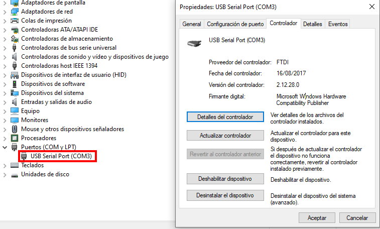
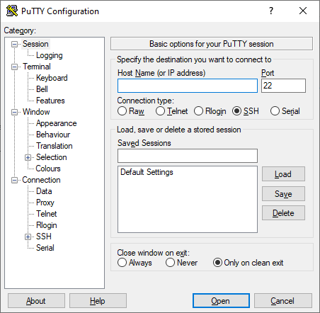
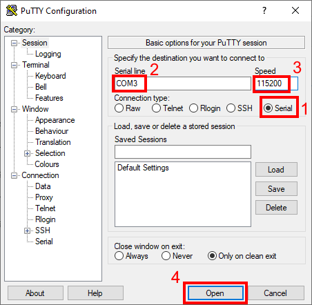
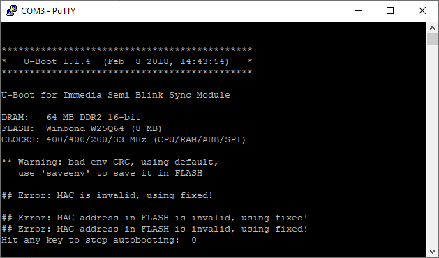

# Establishing connection

Connect the USB in your computer and, in case drivers are not directly installed, install the ones provided by the vendor. You should see in your Device Manager something like this:

Connect the syncmodule USB to the computer (just for giving power, you can use the outlet too)

Install Putty application from [here](https://www.chiark.greenend.org.uk/~sgtatham/putty/latest.html). This is how it looks like:

Choose Serial and write down your COM port and 115200 as speed

Click on open and following screen should appear

Text may change the important thing is you see readable text. If you see some strange characters check which speed you set (115200). If no text appears connect and disconnect the syncmodule as could simply be there is no trace to show since you opened the connection.

Ok so now we are connected to our syncmodule and can see any log dumped to the screen but system is closed, we will correct this in the next tutorial [Factory reset](reset.md).
