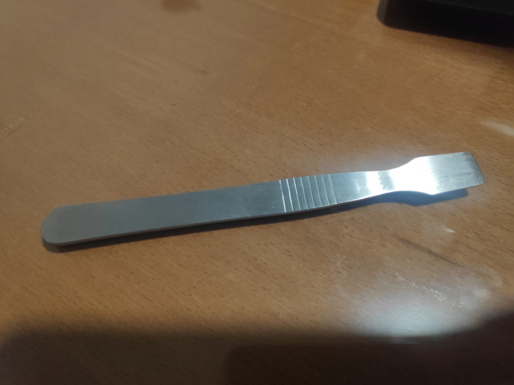

# Opening covers

It's time to open the Sync Module.

Grab something flat enough to fit inside the notch that surrounds the top cover.

Put the tool in the notch and carefully pry until it pops up.

Remove the cover but be careful because it can be stuck with the antenna

You did it! Now go to [USB to TTL device](usb2ttl.md)
