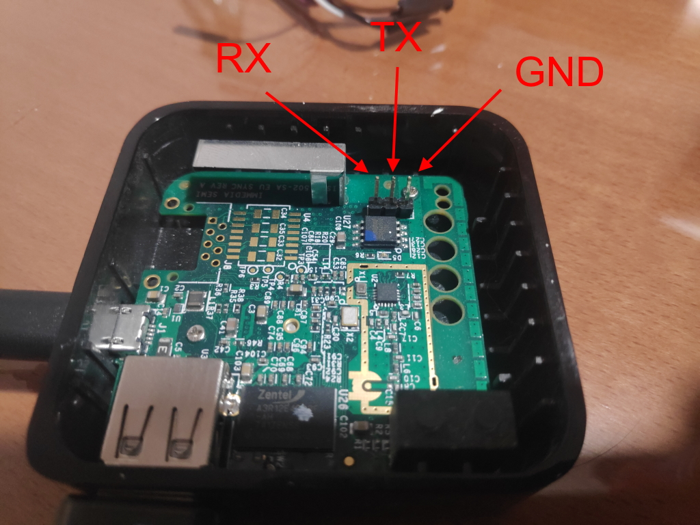

# USB to TTL device

Buy one USB to TTL device, Internet is plenty of them. Here is the [link](https://www.amazon.es/gp/product/B07BBPX8B8) for the one I use. It's more expensive but it's protected against dust and comes with the cables. It will only be used to open a backdoor for later connecting through network so the cheapest one it's ok I guess.

<b>Here comes the dangerous part</b>

<table>
<tr><td></td><td>Identify the VCC pin and <b>do not connect anything there during the whole process</td></tr>
</table>

Locate three pins in the SyncModule with the name J3 in it

Identify GND, RX and TX in your USB to TTL device and:

* Connect your RX pin to the Sync Module TX pin
* Connect your TX pin to the Sync Module RX pin
* Connect your GND pin to the Sync Module GND pin

You can see my connections here

You are done! Let's [test the connection](connect.md)
